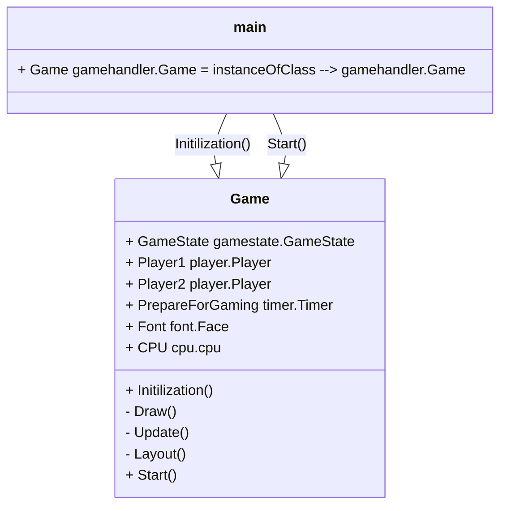

```mermaid
classDiagram
    class main {
        + Game gamehandler.Game = instanceOfClass --> gamehandler.Game
    }
    class Game{
        + GameState gamestate.GameState
        + Player1 player.Player
        + Player2 player.Player
        + PrepareForGaming timer.Timer
        + Font font.Face
        + CPU cpu.cpu
        + Initilization()
        - Draw()
        - Update()
        - Layout()
        + Start()
    }
    main --|> Game : Initilization()
    main --|> Game : Start()

```
